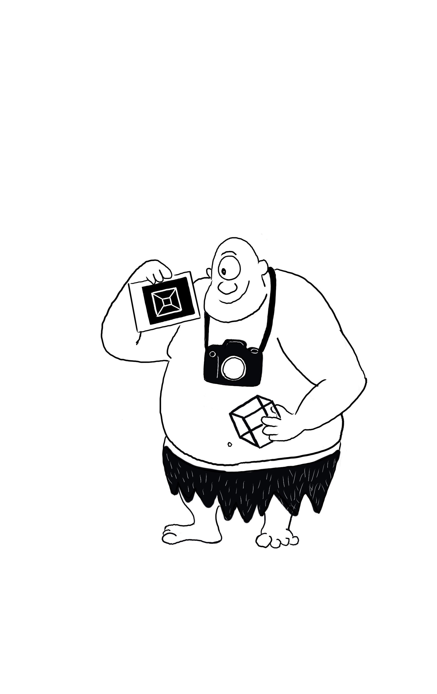

#####   Politecnico di Milano, 2024/2025

This page collects some material for the the practical sessions of Image Analysis and Computer Vision taught by Prof. Caglioti. Please consult weebep for other resources.

***

> ##### Theses in Computer Vision available!
If you are interested in doing a [thesis in Computer Vision](https://magrilu.github.io/thesis/) send me an email to schedule a meeting!

***

## Material

* [Shared folder](https://polimi365-my.sharepoint.com/:f:/g/personal/10755186_polimi_it/Eob0HjQK20FKj315cVLFH-sBYxt9Clukjnq4zmjmtBWHSg?e=Tvkoqq) collecting the "todo" source files and the data I used during the practical sessions.
* Recordings of my practical sessions [link](https://docs.google.com/spreadsheets/d/1SWuwLzWNb-8hCOPULQUSghMeCD174pNePTUSh1BfUuY/edit?usp=sharing)
* The template for the report of the final project: [zip file](https://polimi365-my.sharepoint.com/:u:/g/personal/10755186_polimi_it/EXhqADe0KkZGlp9CWQ1nitsBlfI9aLphLl1cqkoIHmJ5Yg?e=X0joWl)

#### Homogeneous coordinates, lines and vanishing points

    {% include figure.html path="assets/img/cube_iacv.png" class="img-fluid rounded" style="max-width: 20%;" zoomable=false %} 

* Introduction to MatLab: [demo code](https://polimi365-my.sharepoint.com/:b:/g/personal/10755186_polimi_it/ES_imzLg2ClHiSaPRU6EXOsBVhtbhJZDJBdkl0-GyMXVsg?e=gUqsRg).
* Introduction to image processing in MatLab: [demo code](https://polimi365-my.sharepoint.com/:b:/g/personal/10755186_polimi_it/EWekWQ3NPDlCqubZjncu3sABQe1IIw0gaFzzvnJXtIJEJw?e=iZNWXg).
* Homogenous coordinates, points line and duality: [demo code](https://polimi365-my.sharepoint.com/:b:/g/personal/10755186_polimi_it/EXwgWsWwyIVDu_FCkdQ3pRsBhU1-jQQchsbl7WmEdQHrZw?e=prh6aj). 
* Drawing a cube in isometric projection: [demo code](https://polimi365-my.sharepoint.com/:b:/g/personal/10755186_polimi_it/EREdWc5lK9BDoj0VfpkDxy0BHuuZogbld4d2sV7H_Xu1gw?e=dq8oll).

Extra:
* Vanishing points, vanishing lines and affine rectification: [demo code](https://polimi365-my.sharepoint.com/:b:/g/personal/10755186_polimi_it/Edc6GXQEmp1Gnzs_215QHyUBde22dhS_0jW6TA_ezCBqAA?e=6qNhqA).
* Affine measurements of objects on a plane: [demo code](https://polimi365-my.sharepoint.com/:b:/g/personal/10755186_polimi_it/ESucvFpICgNIs5DoD1DIQ38BpqziA8p_YfvC8z9CSdt8Lg?e=GF0cLw).
* Horizon from three equally spaced coplanar lines: [demo code](https://polimi365-my.sharepoint.com/:b:/g/personal/10755186_polimi_it/Ebr1CMH6bNtFhmM8wbYLbnIB6vxB5Gno_oLOx6Pyc7x2Tw?e=J5SPhJ).

    {% include figure.html path="assets/img/metric_iacv.jpg" class="img-fluid rounded"  style="max-width: 50%;" zoomable=false %} 

#### Conic and Homography estimation via DLT

     

* Conic estimation via DLT: [demo code](https://polimi365-my.sharepoint.com/:u:/g/personal/10755186_polimi_it/EX-98jj4zalDvUju9wOPa7ABoWjTtFNQDqi07X8M4rHZSQ?e=0W2MSz).
* Homography estimation via DLT: [demo code](https://polimi365-my.sharepoint.com/:b:/g/personal/10755186_polimi_it/ERuj4hJpxUlOqk-ckPFHK68BrzlIGEPk6EjpPAbJVglu8A?e=ZWAsrl).
* Warping and bilinear interpolation: [demo code](https://polimi365-my.sharepoint.com/:b:/g/personal/10755186_polimi_it/ES57RFUqG79Bvu8FWaG1EI0BrQysPOxFDTkbUBLCI31yEw?e=i6v7pm).
* Image stiching: [demo code](https://polimi365-my.sharepoint.com/:b:/g/personal/10755186_polimi_it/EerjLTrVropOj0L0SbrUzT8BTlsr46A0iE2Ivp_0Ge74Aw?e=jVUrZ9).
* Image rectification: [demo code](https://polimi365-my.sharepoint.com/:b:/g/personal/10755186_polimi_it/EZ6WvA7bSTlGtjdRuuP0mzUB3XywbMEhqdK50Is68mdupQ?e=gHGJZ9).

[Here](https://polimi365-my.sharepoint.com/:f:/g/personal/10755186_polimi_it/EnkMVsuAT3JGmQQ25LsDZxUBauW3ukGSPrdOFs--BqLTHQ?e=MUdZmg) are some of the functions employed (please note that these functions are for didactic purposes only).

#### Rectifications

     

* Affine rectification: [demo code](https://polimi365-my.sharepoint.com/:b:/g/personal/10755186_polimi_it/EXwBb81GfuFJugoxEyZTh6kBV3xMQlPByw_GvWTsomFCiA?e=1bPnB0).
* Metric rectification: [demo code](https://polimi365-my.sharepoint.com/:b:/g/personal/10755186_polimi_it/EQUpmenNUeRNqZeXWf60SyABPlKE2oYt_iK_ynzoh2k4UQ?e=MvvO4B).
* Metric rectification stratified: [demo code](https://polimi365-my.sharepoint.com/:b:/g/personal/10755186_polimi_it/EevfTOckyURLq99y7R3RmsgBR-E0lv4dg08fMIsj_PoADg?e=zFVEIt).
* Metric rectification from one circle: [demo code](https://polimi365-my.sharepoint.com/:b:/g/personal/10755186_polimi_it/ESpNIqwWmHBBvEiOlf07YewBSBc43kgtv2oiH3hS3oNIUA?e=ig8CHG).
* Metric rectification from two circles: [demo code](https://polimi365-my.sharepoint.com/:b:/g/personal/10755186_polimi_it/EZla6bNYXQhKs4cyhCdzKDkBZc30gHPf8uVqClnHfZPUHg?e=T8oT1s).

#### Robust fitting

     

* [Slides](https://polimi365-my.sharepoint.com/:b:/g/personal/10755186_polimi_it/Ee-2oFfzrZFOpPDVcGP7aeABfRjSxqwl6z7UjCLitOdIsA?e=HjiNBa)
* Random Sample Consensus : [demo code](https://polimi365-my.sharepoint.com/:b:/g/personal/10755186_polimi_it/EXhVEKV9ZSRCisPpBtvlCloBDxTRaJoClD_JEpBtzOz5Fw?e=5wt7gR).
* Least Median of Squares: [demo code](https://polimi365-my.sharepoint.com/:b:/g/personal/10755186_polimi_it/EU649eHcmbdIo6MT4pxKT8wBzAhLP6RK7NlNPbnke43q0Q?e=vJZhfE).
* Multi-model fitting: [demo code](https://polimi365-my.sharepoint.com/:b:/g/personal/10755186_polimi_it/Ed-xn64yLU5NhKz0m-eyk3gByCw1HSP5AFLw9wEvAKA1hQ?e=bggGdk).

#### Matching

     

* [Slides](https://polimi365-my.sharepoint.com/:b:/g/personal/10755186_polimi_it/EX2JdhAq3OJDqPhsfxEnVgwBVPzknIyS1g06uJzvXW62JQ?e=YPHffc)
* Feature matching: [demo code](https://polimi365-my.sharepoint.com/:b:/g/personal/10755186_polimi_it/ER-BbzdpZIxAs8ZSpbA-g4AB6RC9Yz4qq4uMmXLn7k3CKw?e=KZggFs).

***

[thesisProposal]:https://boracchi.faculty.polimi.it/docs/Thesis_Opportunities_Boracchi.pdf
