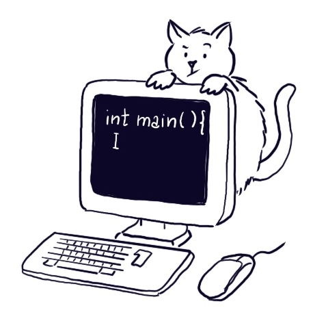

#####   Ingegneria Gestionale, PoliMi, 2024/2025

*** 

* [Cartella condivisa](https://polimi365-my.sharepoint.com/:f:/g/personal/10755186_polimi_it/EgjfFrnKl7pOv1bmhrscOkgBpJcrYKu0yCrjEfnlXevivw?e=dlA5JO) con i materiali del corso
* [Setup dell'ambiente di sviluppo](https://polimi365-my.sharepoint.com/:b:/g/personal/10755186_polimi_it/EXO6Nb0jwEdLgtsjHNIfwzwBMwK-wpiAh-hdf-MHh-dU2g?e=uvV7rc )
* [Link alle registrazioni](https://docs.google.com/spreadsheets/d/1AOhwVo7HZd1SCarp8LmnCF28lwVxABxuuRHCtluKuyY/edit?usp=sharing) 
* [Programma del corso](https://www11.ceda.polimi.it/schedaincarico/schedaincarico/controller/scheda_pubblica/SchedaPublic.do?&evn_default=evento&c_classe=837446&lang=IT&__pj0=0&__pj1=cbc4f2d6f0cebd69d066919952e0ce7c)


***


### Calendario

La prima lezione del corso si terrà lunedì 16/09/24 in L.09 dalle 9:30 alle 11:15.

<iframe src="https://calendar.google.com/calendar/embed?height=300&wkst=2&bgcolor=%23ffffff&ctz=Europe%2FRome&showTitle=0&showDate=1&showPrint=0&showTabs=0&showTz=0&showCalendars=0&mode=AGENDA&showNav=0&src=ZTMwOWNlMWQ3NjZmYjRkNzE4Yjc5NDM2MjY0NDIxYjFjM2RkNWVjODg0NjczZTkyMGVkMjMxY2IzNzlmOWFjM0Bncm91cC5jYWxlbmRhci5nb29nbGUuY29t&color=%2333B679" style="border-width:0" width="800" height="300" frameborder="0" scrolling="no"></iframe>


***

### Snippets

Durante le lezioni, per alcuni esempi ed esercizi sono forniti dei frammenti di codice, li trovate nelle cartelle [Snippets_todo](https://polimi365-my.sharepoint.com/:f:/g/personal/10755186_polimi_it/EmhstNQzhx9OpYEINFU-oYwBIW0FlbC6E835XnoT2JWRMA?e=lb0VJx) e [Snippets](https://polimi365-my.sharepoint.com/:f:/g/personal/10755186_polimi_it/EsVBVYMBZBdCtRXAV9h4fjIBAFgbnHGhSN8-1EnLqzf4eQ?e=tct3RT)
Nella versione ```todo```, il codice è solamente abbozzato con parti mancanti da completare. Siete invitati a provare voi stessi a completarlo, dopo aver letto i commenti che suggeriscono qualche idea per la soluzione o sottolineano alcuni aspetti importanti.
Quando disponibile, potete consultare la versione completa per verificare la correttezza della vostra soluzione. Tuttavia non c'è un solo modo per risolvere un esercizio! Provate diverse strategie risolutive e domandatevi quale è la migliore.

<div class="row justify-content-sm-center">
    <div class="col-sm-1 mt-3 mt-md-0">
       
    </div>
    <div class="col-sm-1 mt-3 mt-md-0">
        
    </div>
</div>

### Esercitazioni

Le esercitazioni del corso sono tenute da Dr. Michele Zanella, Dr. Michele Craighero.  Il materiale delle esercitazioni è disponibile anche su Webeep.

### Laboratori

I laboratori del corso sono tenuti da Roberto Basla, Riccardo Margheritti e Olmo Notarianni il venerdì secondo il calendario.
I laboratori sono articolati su 3 squadre in 3 turni differenti:
* Squadra 1: BL27.1.4, 8:15-11:15, da ABDELGALIL a BERTOLI 
* Squadra 2: BL27.1.4, 11:15-14:15,  da BESATI a CAMPAGNA 
* Squadra 3: B6.2.1, 11:15-14:15,  da CAMPOREALE a CHITTI

***

### Esame

L'esame consiste di due parti:
* Parte A (durata 30 minuti - 4 punti): domande a risposta multipla. Ogni risposta corretta vale 0,5 punti; una risposta sbagliata o lasciata vuota vale 0. La prova si intende superata se si risponde correttamente ad almeno 5 domande su 8. 
* Parte B (durata 2 ore - 29 punti): 4 esercizi di programmazione.

Condizione necessaria (ma non sufficiente) per passare l'esame è aver superato la parte A.  Il voto finale è dato dalla somma dei punteggi della parte A e B.


int risposte_corrette_parte_A;
int punti_parte_A ,punti_parte_B;
// inizializzare le variabili con i vostri voti
voto_finale = punti_parte_A + punti_parte_B;
if(risposte_corrette_parte_A>=5){
    if(voto_finale>=18){
        fprintf("complimenti! Hai passato l'esame");
    }
    else{
        fprintf("non scoraggiarti, studia meglio ed esercitati ancora!");
    }
}



I **temi d'esame** degli anni passati sono disponibili [qui](https://polimi365-my.sharepoint.com/:f:/g/personal/10755186_polimi_it/EoqBf6kpCkhEg0mr3tjv7J0BpolR6VzGWB5FNBaO2uRRZA?e=W91r6P). È un'ottima idea svolgere i vecchi temi d'esame per verificare la propria preparazione.

 Vi verranno fornite per tempo istruzioni dettagliate su come procedere per poter svolgere l'esame in modo sereno. 


***

> Studiare informatica serve per imparare a...

* _analizzare e risolvere  problemi_:
    nel vostro lavoro di ingegneri gestionali affronterete scenari decisionali complessi che richiedono creatività e precisione. L'informatica insegna a pensare in modo logico e ad aggredire problemi difficili scomponendoli  in fasi più piccole e gestibili.
* _ottimizzare le soluzioni_:
    non basta risolvere un problema, un ingegnere gestionale deve assicurarsi che la soluzione trovata sia la migliore possibile. Una mente algoritmica è in grado di snellire le operazioni, ridurre i costi e migliorare l'efficienza complessiva di qualsiasi processo, dalla gestione della catena di approvvigionamento di un magazzino alla pianificazione delle attività di un'azienda.
* _automatizzare i processi_:
    l'informatica insegna la pigrizia... saper individuare le opportunità di automazione all'interno di un'organizzazione, non solo aumenta la produttività, ma anche la possibilità di concentrarsi su altre attività più strategiche e innovative.
* _collaborare consapevolemente_:
    l'aver avuto esperienze di programmazione vi permetterà collaborare con cognizione di causa con professionisti di altri settori, tecnici e sviluppatori di software.
* _stare al passo_:
    le nuove tecnologie stanno ridisegnando completamente il mondo del lavoro. Una buona conoscenza dell'informatica di base è la grammatica con cui potrete impadronirvi delle tecnologie del momento e di quelle del futuro.

***

####  Risorse aggiuntive 

* [Dispensa a cura del Prof. Barenghi](https://barenghi.faculty.polimi.it/lib/exe/fetch.php?media=teaching:dispensa.pdf) che copre i prima argomenti del corso.
* [The C Programming Language](https://venkivasamsetti.github.io/ebookworm.github.io/Books/cse/C%20Programming%20Language%20(2nd%20Edition).pdf).
* Un [compilatore online](https://repl.it/languages/c) che può essere utile per iniziare a familiarizzare con il C. Tuttavia cercate di iniziare ad utilizzare un IDE il prima possibile.
* Peter Norvig, [Teach Yourself Programming in Ten Years](http://norvig.com/21-days.html) (Peter Norvig è stato Director of Research a Google).
* George Polya, [Come si risolve un problema](https://math.hawaii.edu/home/pdf/putnam/PolyaHowToSolveIt.pdf).


***


*I would like to thank Monica Vitali, Diego Stucchi, Marco Lattuada, Marcello Restelli, Giacomo Boracchi and Andrea Fusiello for sharing with me their advices and their teaching materials on which the slides of this course are largely based.*


