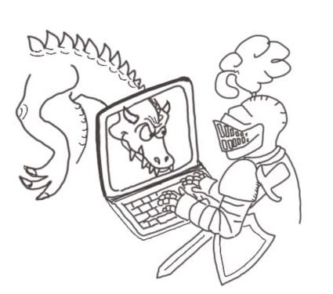

#####   Ingegneria Matematica, PoliMi, 2025/2026
######   L. Magri & G. Boracchi
*** 

* [Cartella condivisa](https://polimi365-my.sharepoint.com/:f:/g/personal/10245349_polimi_it/EpqeknM7KMxHhfbikS5NhNoBYwq1sb7njhE6zj4Ck-8f1w?e=cJaOw1) con i materiali del corso
* [Esercitazioni](https://alessandriniluca.github.io/index.html)
* Setup dell'ambiente di sviluppo: [win10 & mac](https://boracchi.faculty.polimi.it/teaching/InfoA/2021_InfoA_installazione_IDE.pdf), [win11](https://boracchi.faculty.polimi.it/teaching/InfoA/Install_code_blocks%20_win11.pdf)
* [Programma del corso](https://www11.ceda.polimi.it/schedaincarico/schedaincarico/controller/scheda_pubblica/SchedaPublic.do?&evn_default=evento&c_classe=863518&lang=IT&__pj0=0&__pj1=d9ffc733a749aeaeef990d6075b83159)
* [Temi d'esame degli anni precedenti](https://boracchi.faculty.polimi.it/teaching/InfoA.htm)
* [Dispensa da utilizzare all'esame](https://boracchi.faculty.polimi.it/teaching/InfoA/dispensaEsame.pdf)

***

### Calendario

<iframe src="https://calendar.google.com/calendar/embed?height=500&wkst=2&ctz=Europe%2FRome&showPrint=0&showDate=0&showTabs=0&showTz=0&mode=AGENDA&showCalendars=0&showTitle=0&src=aDJrbGQ2ajVsZGs2ZTNqMTZjNTVpN3BudWdAZ3JvdXAuY2FsZW5kYXIuZ29vZ2xlLmNvbQ&color=%23d4fb79" style="border-width:0" width="800" height="500" frameborder="0" scrolling="no"></iframe>

***

### Esercitazioni

Le esercitazioni del corso sono tenute da Dr. Luca Alessandrini e i materiali sono disponibili a [questa pagina](https://alessandriniluca.github.io/index.html).

### Temi d'esame 

2023/2024

* [Prima prova](https://forms.office.com/e/GdxfxP3mBM)
* [Appello gennaio](https://forms.office.com/e/REVRfR3pbc)
* [Appello febbraio](https://forms.office.com/e/9TP0e1k9Dp)
* [Appello giugno](https://forms.office.com/e/kubrABsKW3)
* [Appello luglio](https://forms.office.com/e/JmrSTi8z4T)
* [Appello settembre](https://forms.office.com/e/mSneQ40Db7)

2022/2023
* [Prima prova](https://forms.office.com/r/qVvYqExphw)
* [Appello gennaio](https://forms.office.com/e/sHUPtML1tR)
* [Appello febbraio](https://forms.office.com/e/NvC0Juckch)
* [Appello giugno](https://forms.office.com/e/F52ErA30CG)
* [Appello luglio](https://forms.office.com/e/3xJeJtJJfY)
* [Appello settembre](https://forms.office.com/e/Z5tNSTiUhf)

2021/2022
* [gennaio 2022](https://forms.office.com/r/ePBzBxvs8V)
* [febbrario 2022](https://forms.office.com/r/9vr3mha1pT)
* [giugno 2022](https://forms.office.com/r/gXD8bNtv7a)
* [luglio 2022](https://forms.office.com/r/aPN3wfxVRC)
* [settembre 2022](https://forms.office.com/r/R142KQeGsb)

2020/2021
* [19 febbraio 2021](https://forms.office.com/Pages/ResponsePage.aspx?id=K3EXCvNtXUKAjjCd8ope6_dVLrExCjFKnjNfU-Tb1b1UOE0zQThIS1gyVTJSUzVZMElCODM0T0Q2MC4u)
* [1 febbraio](https://forms.office.com/Pages/ResponsePage.aspx?id=K3EXCvNtXUKAjjCd8ope60vwKNvHTbBBlryvNtxfrkhUMUJYWDJCOUo3SlNHOVVRNFIyWjA0UENCTy4u)
* [agosto 2021](https://forms.office.com/Pages/ResponsePage.aspx?id=K3EXCvNtXUKAjjCd8ope60vwKNvHTbBBlryvNtxfrkhUQ01LTklVRTBHMEJSRVc4NklYWDY4UEsyTC4u)
* [giugno 2021](https://forms.office.com/Pages/ResponsePage.aspx?id=K3EXCvNtXUKAjjCd8ope6_dVLrExCjFKnjNfU-Tb1b1UQllKOUI5OFlPN0tZSlBMNVEwVFVNV0JCTy4u)
* [luglio 2021](https://forms.office.com/Pages/ResponsePage.aspx?id=K3EXCvNtXUKAjjCd8ope60vwKNvHTbBBlryvNtxfrkhURUpRV05MSjJMOFROOEY0UkhVVlJBRjlNNS4u)

***

####  Risorse aggiuntive 

* [Pagina del corso](https://boracchi.faculty.polimi.it/teaching/InfoA.htm) degli anni precedenti curata dal prof. Boracchi.
* [Dispensa a cura del Prof. Barenghi](https://barenghi.faculty.polimi.it/lib/exe/fetch.php?media=teaching:dispensa.pdf) che copre i prima argomenti del corso.
* [The C Programming Language](https://venkivasamsetti.github.io/ebookworm.github.io/Books/cse/C%20Programming%20Language%20(2nd%20Edition).pdf).
* Un [compilatore online](https://repl.it/languages/c) che può essere utile per iniziare a familiarizzare con il C. Tuttavia cercate di iniziare ad utilizzare un IDE il prima possibile.
* Peter Norvig, [Teach Yourself Programming in Ten Years](http://norvig.com/21-days.html) (Peter Norvig è stato Director of Research a Google).
* George Polya, [Come si risolve un problema](https://math.hawaii.edu/home/pdf/putnam/PolyaHowToSolveIt.pdf).

***

