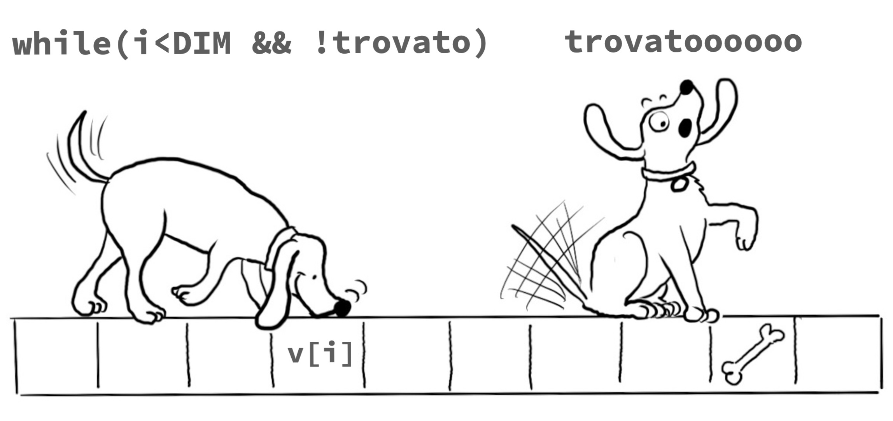

#####   Ingegneria Matematica, PoliMi, 2025/2026, L. Magri & G. Boracchi

*** 

Pagina in costruzione per gli studenti di ingegneria matematica

***

### Calendario

La prima lezione del corso si terrà lunedì XXX in XXX dalle XXX alle XXX.

<iframe src="https://calendar.google.com/calendar/embed?height=300&wkst=2&bgcolor=%23ffffff&ctz=Europe%2FRome&showTitle=0&showDate=1&showPrint=0&showTabs=0&showTz=0&showCalendars=0&mode=AGENDA&showNav=0&src=ZTMwOWNlMWQ3NjZmYjRkNzE4Yjc5NDM2MjY0NDIxYjFjM2RkNWVjODg0NjczZTkyMGVkMjMxY2IzNzlmOWFjM0Bncm91cC5jYWxlbmRhci5nb29nbGUuY29t&color=%2333B679" style="border-width:0" width="800" height="300" frameborder="0" scrolling="no"></iframe>

***

### Snippets

### Esercitazioni

Le esercitazioni del corso sono tenute da Dr. Luca Alessandrini. 

### Laboratori

I laboratori del corso sono tenuti da Roberto Basla, Riccardo Margheritti e Olmo Notarianni il venerdì secondo il calendario.
I laboratori sono articolati su 3 squadre in 3 turni differenti:
* Squadra 1: BL27.1.4, 8:15-11:15, da ABDELGALIL a BERTOLI 
* Squadra 2: BL27.1.4, 11:15-14:15,  da BESATI a CAMPAGNA 
* Squadra 3: B6.2.1, 11:15-14:15,  da CAMPOREALE a CHITTI

***

### Esame

***

> Studiare informatica serve per imparare a...

* _analizzare e risolvere problemi_:
nel vostro lavoro di ingegneri matematici vi troverete ad affrontare modelli complessi, dati numerosi e fenomeni non immediatamente intuitivi. L’informatica vi fornisce gli strumenti per tradurre queste sfide in procedure chiare, scomporle in passi gestibili e arrivare a soluzioni precise ed eleganti.
* _trasformare la teoria in pratica_:
le equazioni non vivono solo sulla carta. Per verificarle, simularle e applicarle a casi concreti serve la potenza di calcolo. L’informatica permette di mettere alla prova le idee, esplorare scenari diversi e misurare l’impatto delle vostre scelte modellistiche.

* _ottimizzare e calcolare in grande_:
un conto è risolvere un esercizio a mano, un altro è affrontare migliaia di variabili o sistemi con milioni di dati. Pensare in termini algoritmici vi aiuta a cercare non solo soluzioni corrette, ma anche efficienti, in grado di scalare a problemi di dimensioni reali.

*_automatizzare procedure ripetitive_:
i matematici devono essere pigri! molti calcoli, simulazioni o verifiche si prestano a essere programmati una volta per tutte. Automatizzare significa liberare tempo ed energie da dedicare all’intuizione matematica e all’interpretazione dei risultati.

* _dialogare con il mondo scientifico e tecnologico_:
oggi ogni disciplina quantitativa – dalla fisica alla finanza, dall’ingegneria all’intelligenza artificiale – vive di calcolo e programmazione. Avere familiarità con l’informatica vi permetterà di collaborare con altri professionisti parlando un linguaggio comune.

* _stare al passo_:
i metodi computazionali si evolvono rapidamente e aprono possibilità nuove per la matematica applicata. Conoscere le basi dell’informatica significa avere la chiave per comprendere e padroneggiare le tecnologie del presente e del futuro.
***

####  Risorse aggiuntive 

* [Dispensa a cura del Prof. Barenghi](https://barenghi.faculty.polimi.it/lib/exe/fetch.php?media=teaching:dispensa.pdf) che copre i prima argomenti del corso.
* [The C Programming Language](https://venkivasamsetti.github.io/ebookworm.github.io/Books/cse/C%20Programming%20Language%20(2nd%20Edition).pdf).
* Un [compilatore online](https://repl.it/languages/c) che può essere utile per iniziare a familiarizzare con il C. Tuttavia cercate di iniziare ad utilizzare un IDE il prima possibile.
* Peter Norvig, [Teach Yourself Programming in Ten Years](http://norvig.com/21-days.html) (Peter Norvig è stato Director of Research a Google).
* George Polya, [Come si risolve un problema](https://math.hawaii.edu/home/pdf/putnam/PolyaHowToSolveIt.pdf).

***

*I would like to thank Monica Vitali, Diego Stucchi, Marco Lattuada, Marcello Restelli, Giacomo Boracchi and Andrea Fusiello for sharing with me their advices and their teaching materials on which the slides of this course are largely based.*

