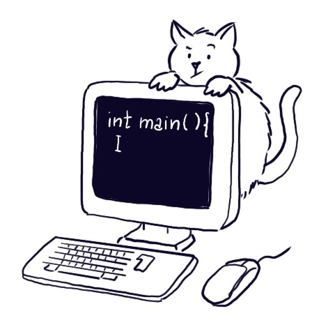

##### Ingegneria Matematica, PoliMi, 2026/2027

***

* [Cartella condivisa](https://polimi365-my.sharepoint.com/:f:/g/personal/10755186_polimi_it/IgB0gkOy5VumQL93fFoeJTiQAe_2l4xc5jfLCe-XWm-Vr8o?e=3Y4Izz) con le slide e il materiale delle lezioni
* Setup dell'ambiente di sviluppo: [Windows 10 & Mac](https://boracchi.faculty.polimi.it/teaching/InfoA/2021_InfoA_installazione_IDE.pdf), [Windows 11](https://boracchi.faculty.polimi.it/teaching/InfoA/Install_code_blocks%20_win11.pdf)
* [Programma del corso](https://onlineservices.polimi.it/schedaincarico/schedaincarico/controller/scheda_pubblica/SchedaPublic.do?&evn_default=evento&c_classe=889289&lang=IT&__pj0=0&__pj1=6f11c3f0e0150890ebcd82576576c4aa)

***

### Calendario

L'orario settimanale delle lezioni è indicativamente **lunedì 15:00–17:00,
martedì 9:00–13:00, mercoledì 9:00–13:00 e venerdì 11:00–14:00**.

Il calendario sottostante riporta **date, aule ed eventuali variazioni o lezioni di recupero** e costituisce il riferimento aggiornato per il corso.

<iframe src="https://calendar.google.com/calendar/embed?src=5e275c0e64b94f9358937225f0104afc4f7fff4173249ec76ee3dce0dac0e854%40group.calendar.google.com&ctz=Europe%2FRome" style="border: 0" width="800" height="500" frameborder="0" scrolling="no"></iframe>

***

### Esercitazioni

Le esercitazioni del corso sono tenute dal **Dr. Luca Alessandrini**. Il materiale delle esercitazioni, gli esercizi proposti e le relative soluzioni sono disponibili sulla [pagina delle esercitazioni](https://alessandriniluca.github.io/index.html).

***

### Laboratori

I laboratori sono dedicati alla programmazione in C e allo svolgimento guidato di esercizi.
[Calendario e materiale dei laboratori](https://docs.google.com/spreadsheets/d/1nb7kYFJAR_dKXedBRcHyG4gSF-P1UaDzye51h0UnuL8/edit?usp=sharing)

***

### Tutorati

Durante il semestre sono previsti incontri di tutorato per esercitarsi sugli argomenti del corso e prepararsi alle prove d'esame.
[Calendario e informazioni sui tutorati](https://alessandriniluca.github.io/tutorato.html)

***

### Modalità d'esame

L'esame consiste in una **prova scritta** seguita da una **prova orale**.

La prova scritta si svolge al computer. Gli esercizi vengono proposti tramite Microsoft Forms e ciascuno studente deve utilizzare il proprio PC per sviluppare le soluzioni e caricare sul form il codice prodotto.
Per gli esercizi di programmazione ci si aspetta che il codice consegnato compili e venga eseguito correttamente. È quindi importante arrivare all'esame con un ambiente di sviluppo correttamente installato e configurato. Gli unici IDE ammessi sono Dev C++,
CodeBlocks, XCode.
Le istruzioni per l'installazione e la configurazione dell'ambiente consigliato sono disponibili

La prova scritta comprende tre esercizi di **programmazione in C** e un esercizio sull'SQL. Per essere ammessi alla prova orale è necessario ottenere **almeno 10 punti complessivi nei tre esercizi di programmazione in C**.

#### Prova in itinere

Durante il semestre è prevista una **prova in itinere (compitino)**. Il superamento della prova consente di **non svolgere il primo degli esercizi della prova scritta** negli appelli di **gennaio e febbraio**. Il beneficio è valido esclusivamente per questi due appelli.

Durante la prova scritta è possibile utilizzare la [dispensa del corso](https://boracchi.faculty.polimi.it/teaching/InfoA/dispensaEsame.pdf).

***

### Temi d'esame

Per gli appelli dell'ultimo anno sono disponibili sia il tema d'esame sia la relativa soluzione.

| Appello 2025/26 | Tema | Soluzione |
| --- | :---: | :---: |
| Prima prova | [Form](https://forms.cloud.microsoft/e/TudUTUp8hB) | [Soluzione](LINK_SOLUZIONE) |
| Gennaio | [Form](https://forms.cloud.microsoft/e/U1bBujvcBe) | [Soluzione](LINK_SOLUZIONE) |
| Febbraio | [Form](https://forms.cloud.microsoft/e/ksBDW8Vqkk) | [Soluzione](LINK_SOLUZIONE) |
| Giugno | [Form](https://forms.cloud.microsoft/e/sg6dhgnS7N) | [Soluzione](LINK_SOLUZIONE) |
| Luglio | [Form](https://forms.cloud.microsoft/e/fjkfDU7Y8N) | [Soluzione](LINK_SOLUZIONE) |
| Settembre | [Form]() | [Soluzione]() | 

#### Archivio TDE

**2024/25:** [Prima prova](https://forms.office.com/e/3UuDAyQYq7) · [Gennaio](https://forms.office.com/e/8ML1ve1zXc) · [Febbraio](https://forms.office.com/e/Z4QRAS2ZuL) · [Giugno](https://forms.office.com/e/CSbGfDbNcT) · [Luglio](https://forms.office.com/e/PVimnUwt55) · [Settembre](https://forms.office.com/e/bPXZN5udxY)

**2023/24:** [Prima prova](https://forms.office.com/e/GdxfxP3mBM) · [Gennaio](https://forms.office.com/e/REVRfR3pbc) · [Febbraio](https://forms.office.com/e/9TP0e1k9Dp) · [Giugno](https://forms.office.com/e/kubrABsKW3) · [Luglio](https://forms.office.com/e/JmrSTi8z4T) · [Settembre](https://forms.office.com/e/mSneQ40Db7)

**2022/23:** [Prima prova](https://forms.office.com/r/qVvYqExphw) · [Gennaio](https://forms.office.com/e/sHUPtML1tR) · [Febbraio](https://forms.office.com/e/NvC0Juckch) · [Giugno](https://forms.office.com/e/F52ErA30CG) · [Luglio](https://forms.office.com/e/3xJeJtJJfY) · [Settembre](https://forms.office.com/e/Z5tNSTiUhf)

**2021/22:** [Gennaio](https://forms.office.com/r/ePBzBxvs8V) · [Febbraio](https://forms.office.com/r/9vr3mha1pT) · [Giugno](https://forms.office.com/r/gXD8bNtv7a) · [Luglio](https://forms.office.com/r/aPN3wfxVRC) · [Settembre](https://forms.office.com/r/R142KQeGsb)

Per temi ancora precedenti si rimanda alla [pagina storica del corso](https://boracchi.faculty.polimi.it/teaching/InfoA.htm).

***

### Esami integrativi

Gli studenti che devono sostenere un esame integrativo a seguito della convalida di un esame di Informatica di un altro corso di studi devono contattare il docente per concordare il programma della prova.

Tipicamente la prova riguarda memoria dinamica (liste e alberi) e SQL, argomenti trattati nella seconda parte del corso. Poiché il corso utilizza il linguaggio C, a chi proviene da corsi basati su altri linguaggi è consigliato seguire le lezioni almeno a partire dall'introduzione di puntatori e funzioni in C. Il voto finale è calcolato come media pesata sui CFU tra il voto dell'esame convalidato e quello ottenuto nella prova integrativa.

### Risorse aggiuntive

* [Pagina del corso](https://boracchi.faculty.polimi.it/teaching/InfoA.htm) degli anni precedenti curata dal Prof. Boracchi.
* [Dispensa a cura del Prof. Barenghi](https://barenghi.faculty.polimi.it/lib/exe/fetch.php?media=teaching:dispensa.pdf), che copre i primi argomenti del corso.
* [The C Programming Language](https://venkivasamsetti.github.io/ebookworm.github.io/Books/cse/C%20Programming%20Language%20(2nd%20Edition).pdf).
* Un [compilatore online](https://repl.it/languages/c), utile per iniziare a familiarizzare con il C. Cercate tuttavia di iniziare a utilizzare un IDE il prima possibile.
* Peter Norvig, [Teach Yourself Programming in Ten Years](http://norvig.com/21-days.html).
* George Polya, [Come si risolve un problema](https://math.hawaii.edu/home/pdf/putnam/PolyaHowToSolveIt.pdf).